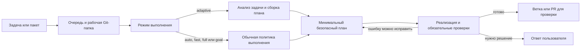

# Tweebit AI Harness

Tweebit AI Harness — локальная система для выполнения задач в Git-проектах. Вы описываете нужный результат, а система подготавливает рабочую ветку, запускает Codex, проверяет изменения и показывает, если требуется ваш ответ.

Сейчас доступны:

- запуск одной или нескольких задач;
- безопасные Git-ветки и отдельные worktree для параллельной работы;
- фоновое выполнение, проверки, повторные попытки и восстановление;
- вопросы и подтверждения для решений, которые нельзя принять автоматически;
- локальный дашборд и полный набор команд `agent`.

Слияние веток и развёртывание всегда остаются действиями человека.

## Установка

Нужны macOS или Linux, Git, Python 3.11+ и аккаунт ChatGPT с доступом к Codex.

Из распакованной папки:

```sh
cd ~/Downloads/agents-main
./install.sh
```

Или из официального репозитория:

```sh
curl -fsSL https://raw.githubusercontent.com/mdvcode/agents/main/install.sh | sh
```

Если терминал ещё не видит команду `agent`:

```sh
hash -r
agent --version
```

После обновления исходников обновите установленную версию:

```sh
agent update --source /path/to/agents
hash -r
agent doctor --full
```

## Первый запуск

Один раз подготовьте проект:

```sh
cd /path/to/project
agent init
agent doctor --full
```

Затем откройте дашборд:

```sh
agent dashboard
```

На стартовом экране:

1. Укажите папку проекта.
2. Опишите результат и критерии готовности.
3. Нажмите **Запустить задачу**.

Остальные настройки можно не менять. Режим выполнения, способ подготовки ветки и номер задачи находятся под **Дополнительно**.

Основные разделы дашборда:

- **Новая задача** — форма запуска и краткое состояние активных задач, проектов и runtime.
- **Проекты** — локальные проекты из текущей истории задач. Это пока не полноценный менеджер Project Blueprint.
- **Задачи** — очередь, вопросы, подтверждения, история и пакетный запуск.
- **Статистика** — подробные показатели и экспериментальное сравнение Full/Adaptive.
- **Настройки** — локальный токен подключения и краткая памятка.

Дашборд работает только на локальном компьютере. `Ctrl+C` останавливает веб-страницу, но не фоновый worker.

## Запуск из терминала

Вместо дашборда можно использовать команды:

```sh
agent task "Исправь ошибку запуска и добавь регрессионный тест"
agent watch
```

По умолчанию используется режим `auto`. Он выбирает обычный или полный безопасный сценарий по содержанию задачи. Экспериментальный Adaptive включается только явно:

```sh
agent task --mode adaptive "Исправь небольшую ошибку и добавь тест"
```

Если проект уже занят другой задачей, создайте отдельный worktree:

```sh
agent task --worktree "Добавь следующую задачу параллельно"
```

Перед запуском обычной задачи checkout должен быть чистым. `agent init` создаёт `.agent/project.yaml` и, если его ещё нет, `AGENTS.md`. Если Git уже игнорирует эти файлы, их не нужно принудительно добавлять.

## Что пока не входит в текущую версию

- полноценный визуальный Project AI Harness Builder;
- загрузка до пяти вложений и PDF-конвейер через интерфейс;
- отдельный визуальный Context Inspector;
- Claude Code и OpenCode runtime adapters;
- Auto Router и Adaptive как режим по умолчанию.

Текущая версия уже является рабочим локальным исполнителем задач, но не выдаёт будущие функции Builder за готовые.

## Как выполняется задача



Один запуск сохраняет одну и ту же задачу, рабочую папку, контрольные точки и Codex-сессию во время реализации, исправлений и проверок. Ошибка теста остаётся внутри исходного запуска, а отдельная дочерняя задача создаётся только для действительно независимой работы.

## Подробный технический справочник (English)

### One task in one repository

```sh
cd /projects/backend
agent task "Fix report export and add a regression test"
agent watch
```

By default, the Harness creates a dedicated task branch in the current checkout. Only one unfinished task may own that checkout.

### One parallel task in an isolated worktree

```sh
agent task --worktree --task-id report-filters \
  "Add report filters without blocking the export task"
```

The worktree has its own branch and checkout but reuses shared pip, uv, npm, Bun, and repository build caches. CLI users opt in explicitly with `--worktree`; the dashboard's **Выполнять параллельно** option selects it automatically.

### Several tasks in one batch

Create `tasks.yaml`:

```yaml
version: 1
repositories:
  backend:
    path: /projects/backend
    max_parallel_tasks: 3
  frontend:
    path: /projects/frontend
    max_parallel_tasks: 2
tasks:
  - repo: backend
    goal: Fix report export
  - repo: backend
    goal: Add report filters
    parallel: true
  - repo: frontend
    goal: Fix the navigation menu
    parallel: true
```

Validate it without changing queue or Git state:

```sh
agent batch --file tasks.yaml --dry-run --json
```

Then enqueue the batch:

```sh
agent batch --file tasks.yaml
agent dashboard
```

`parallel: true` gives that task an isolated worktree. `max_parallel_tasks` is enforced when workers claim tasks, so a busy repository or shared test database cannot consume more than its configured capacity. The dashboard displays all repositories together and can filter by lifecycle, repository, branch, or worker.

The loopback API accepts the same data at `POST /tasks/batch`, either as a YAML `manifest` string or as `repositories` and `tasks` JSON fields. The dashboard is the simplest visual API client and preserves the existing loopback authentication boundary.

### Background child tasks

Users do not create child runs manually. During implementation, Codex may propose a genuinely independent subtask, but deterministic Harness code decides whether it is safe to start.

A writing child receives:

- its own worktree, branch, and Codex thread;
- a strict token and duration budget;
- an explicit `allowed_paths` scope;
- a blocking or non-blocking dependency on its parent;
- no permission to commit, push, publish, merge, or expand scope.

The parent consumes each child result once, handles join conflicts, resumes its original Codex thread, and reruns the complete verification path over the combined diff. Fan-out is limited to three children and graph depth to two levels. Cross-repository work should be submitted explicitly as a batch instead of being invented by a child task.

### Monitor and intervene

```sh
agent status
agent watch --run-id <run-id>
agent failures --run-id <run-id>
```

The status stream reports the current phase, latest SDK event, active tool, time since progress, token budget, and stop reason. The dashboard groups work as **Queued**, **Running**, **Testing**, **Needs input**, **PR ready**, and **Failed**. When active branches touch the same paths, it marks a probable conflict and recommends which branch should publish first and which should rebase and verify again.

## Task execution modes

The default mode is `auto`:

```sh
agent task "Fix a typo in the settings page"
agent task --mode adaptive "Fix a small backend bug and add a regression test"
agent task --mode fast "Apply a small local styling change"
agent task --mode full "Refactor the authentication architecture"
agent task --mode goal "Complete a checkpointed multi-hour objective"
```

| Mode | Behavior |
| --- | --- |
| `auto` | Uses the guarded fast workflow for ordinary work and selects the full workflow when the goal names sensitive or broad changes. It never selects `goal`. |
| `adaptive` | Opts into deterministic task analysis and an auditable minimum-safe execution DAG. Optional roles may be skipped, independent read-only checks may run in parallel, and model-backed roles receive scoped context and the cheapest sufficient profile. Low confidence expands the plan safely. |
| `fast` | Runs the short workflow for at most 15 minutes, with implementation and review as the only model-backed roles. Context, quality, security, and verdict stages are deterministic. |
| `full` | Runs the complete specialist workflow for at most 60 minutes. |
| `goal` | Explicitly runs a checkpointed long objective for at most 4 hours. Use it only when the success condition genuinely needs multiple hours. |

Use `auto` for the current accepted production behavior and `adaptive` when explicitly evaluating or using the new planner. Fast mode automatically escalates to the full workflow before publication if the patch touches protected areas, changes more than five files, exceeds 200 changed lines, or reports increased risk. Required checks and approval gates are never bypassed. The 30-minute role timeout is an emergency limit for one model executor, not the duration of the whole task; workflow, recovery, iteration, and human-attention limits are tracked separately.

## Branch and workspace modes

By default, a task creates or selects a dedicated task branch in the current checkout:

```sh
agent task --task-id fix-startup "Fix startup"
```

Use the clean, already checked-out non-default branch:

```sh
agent task --current-branch "Continue work on this branch"
```

Use an isolated Git worktree for intentional parallel work:

```sh
agent task --worktree --task-id parallel-fix "Run this task in parallel"
```

Configure generated branch names or a different base branch during initialization:

```sh
agent init --force --base-branch develop
agent init --force --branch-prefix team/backend/
```

## Human attention and recovery

When execution needs information, `agent status` or `agent watch` prints an `ATTENTION REQUIRED` block and the exact next command. Answer the same run without starting a replacement task:

```sh
agent answer <run-id> "Use the existing API and preserve backward compatibility"
agent watch --run-id <run-id>
```

Do not include passwords, tokens, private customer data, or other secrets in an answer.

Risk, security, protected-path, and publication decisions require an explicit scoped approval:

```sh
agent approve --run-id <run-id> --reason "Reviewed the reported scope and risk"
```

Use `answer` for missing information and `approve` only for the exact authority request shown by the system.

## Command reference

Run `agent <command> --help` for the complete generated option list.

### Version and updates

```sh
agent --version
agent update
agent update --source /path/to/new/ai-harness
agent update --json
```

- `agent --version` prints the installed version.
- `agent update` installs the latest version and restarts the worker service.
- `--source` installs an explicitly selected local folder, `git+https`, or `git+ssh` source.

### Project initialization

```sh
agent init [--repo PATH] [--project-id ID]
           [--profile auto|agent_workspace|django|nextjs_web]
           [--base-branch BRANCH] [--branch-prefix PREFIX]
           [--force] [--replace-agents] [--json]
```

- `--profile` selects or auto-detects the project validation profile.
- `--force` replaces `.agent/project.yaml` while preserving an existing `AGENTS.md`.
- `--replace-agents` allows `--force` to replace `AGENTS.md` as well.

### Create a task

```sh
agent task [--repo PATH] [--task-id ID] [--branch BRANCH]
           [--current-branch | --worktree] [--keep-paused]
           [--mode auto|adaptive|fast|full|goal] [--priority -100..100]
           [--max-retries 0..10] [--dry-run] [--json]
           "TASK DESCRIPTION"
```

- `--dry-run --json` validates and displays the task envelope without switching branches, starting workers, or changing queue state.
- `--keep-paused` prevents a new task from replacing an older paused task that owns the same checkout.
- Reusing the same explicit `--task-id` returns the existing queue item instead of creating a duplicate.

### Create a task batch

```sh
agent batch --file tasks.yaml [--dry-run] [--json]
cat tasks.yaml | agent batch --file -
```

- A batch may contain up to 50 validated tasks.
- Repository definitions may set `max_parallel_tasks` from 1 to 32.
- `parallel: true` selects an isolated worktree for that item.
- Each item still passes through ordinary project trust, branch, policy, and queue intake checks.
- Invalid items are returned with per-item diagnostics; accepted items retain one shared batch id.

### Worker service

```sh
agent start [--repo PATH] [--workers 1..32] [--json]
agent stop [--json]

agent worker status [--json]
agent worker start [--workers 1..32] [--json]
agent worker restart [--workers 1..32] [--json]
agent worker stop [--json]
```

- `agent start` validates the current project and proactively starts workers. It is optional because `agent task` starts them when necessary.
- `agent stop` and `agent worker stop` gracefully stop the persistent service.
- `agent worker ...` controls the service directly without performing project startup validation.

### Dashboard

```sh
agent dashboard [--repo PATH] [--port PORT] [--no-open]
```

The dashboard binds to loopback and opens in the default browser. The initial **Новая задача** view keeps the project and task description visible, while execution and Git workspace choices stay under **Дополнительно**. Active work, recent repositories, and runtime health are the only secondary blocks on that view. Batch launch, attention, recovery controls, and history live under **Задачи**; detailed Full/Adaptive evidence lives under **Статистика**. Existing answer, approval, retry, abort, filtering, and conflict controls remain unchanged. The browser never calculates or overrides acceptance, security, or approval policy. `NOT ENOUGH DATA` is expected until authoritative paired Adaptive evidence exists. `--no-open` starts the server without opening a browser, and `Ctrl+C` stops only the dashboard server, not the worker service.

### Status and monitoring

```sh
agent status [--repo PATH] [--limit 1..100] [--json]

agent watch [--repo PATH] [--task-id ID] [--run-id ID]
            [--interval SECONDS] [--timeout SECONDS] [--json]
```

- `status` shows compact project, queue, run, and worker state without raw model transcripts.
- `watch` follows state transitions until completion or human attention and returns after 30 minutes by default. Use `--timeout 0` only when an intentionally unbounded terminal wait is desired; if the worker service is down, `watch` returns immediately with the start command.

### Failure inspection

```sh
agent failures [--repo PATH] [--run-id ID] [--limit 1..500] [--json]
agent dead-letters [--repo PATH] [--limit 1..500] [--json]
```

- `failures` lists structured failures and their recovery decisions.
- `dead-letters` lists tasks whose bounded automatic recovery budget is exhausted.

### Run recovery and cancellation

```sh
agent retry <run-id> [--repo PATH] [--json]
agent resume <run-id> [--repo PATH] [--json]
agent abort <run-id> [--repo PATH] [--json]
```

- `retry` retries an existing failed or paused run after its underlying problem has been corrected.
- `resume` continues an existing recorded checkpoint.
- `abort` cancels the run, terminates its active process group when necessary, and preserves its branch, worktree, and run records.

### Human response and approval

```sh
agent answer <run-id> "RESPONSE" [--repo PATH] [--actor NAME] [--json]

agent approve [--repo PATH] [--run-id ID]
              [--actor NAME] [--reason TEXT] [--json]
```

- `answer` supplies missing information and resumes the same checkpoint.
- `approve` consumes one pending scoped approval. When only one eligible run exists, `--run-id` may be omitted.

### Diagnostics

```sh
agent doctor [--repo PATH] [--json]
agent doctor --full [--repo PATH] [--json]
```

The ordinary diagnostic checks installation resources, recovery policy, project configuration, local trust, Git state, Python dependencies, Codex CLI availability, and worker health. `--full` additionally performs the authenticated runtime preflight and may take longer.

## Common operating sequence

```sh
agent doctor --full
agent status
agent failures
agent dead-letters
agent worker status
```

If the worker is unhealthy after an update:

```sh
agent worker restart
agent doctor --full
```

Do not edit queue database rows or workflow state files manually. The recovery commands preserve authoritative run identity, checkpoints, leases, and task workspaces.

## Safety model

- The checkout must be clean before branch switching.
- Protected paths, secrets, authentication, billing, payments, migrations, and production infrastructure receive elevated handling.
- Failed or unavailable required checks cannot be published as successful.
- Low- and medium-risk work may be prepared for review only when repository policy allows it.
- The system never auto-merges or deploys.
- Private run state, raw events, and local memory remain in the Harness control plane and must not be copied into public project output.

## Documentation

- [CLI guide](docs/cli.md)
- [Operator runbook](docs/operator-runbook.md)
- [Onboarding](docs/onboarding.md)
- [System architecture](docs/agent-system.md)
- [Policy](.agent-policy.yaml)
- [Project profiles](.agent-project-profiles.yaml)

## Development checks

From this repository:

```sh
make validate-artifacts
make security
make check
```

`make check` validates contracts, runs the security scan and complete test suite, and checks the Git diff for whitespace errors.
