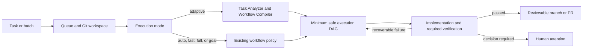

# Tweebit AI Harness by Daryna

Tweebit AI Harness by Daryna runs software tasks in local Git repositories through one command-line interface: `agent` and a private loopback dashboard. Users describe the required result; the Harness prepares the Git workspace, selects a safe execution path, runs implementation and verification, repairs recoverable failures, and returns a reviewable branch or pull request. The Python distribution remains named `ai-harness` for upgrade compatibility.

It supports single tasks, parallel work in isolated Git worktrees, batches across several repositories, background recovery, and explicit human approval when a decision cannot be made safely. Merge and deployment always remain human actions.

The local Tweebit v0.3.0 release candidate keeps this standalone architecture—there is no Chrome
extension and no Codex Projects clone or cloud sync. Its redesigned dashboard uses a lightweight,
collapsible desktop sidebar and a mobile off-canvas menu to separate **Создать**, **Задачи**,
**Статистика**, and **Adaptive Lab**. The focused composer keeps Auto/Adaptive/Fast/Full/Goal
visible and adds private
five-file/PDF intake with defaults of 100 MiB per file and 500 MiB per task. A locally trusted
project may raise those limits to the hard ceilings of 512 MiB per file and 2.5 GiB per task.
Pending uploads are bounded to 32 sets and 6 GiB; direct runtime images are limited to 10 MiB each
and 20 references. File tasks require explicit per-task runtime consent.

Attachment upload, validation, processing, run provenance, and runtime context are implemented.
Both runtimes receive bounded text and PDF-text excerpts as explicitly untrusted data. The Codex SDK
also receives revalidated direct images and scanned PDF pages; the Codex CLI compatibility runtime
accepts text and PDF text only. Text injection is limited to 120,000 bytes total and 24,000 bytes per
reference; image context is fail-closed above 20 references rather than silently truncated. See
[`docs/tweebit-ai-harness-by-daryna-release-comparison.md`](docs/tweebit-ai-harness-by-daryna-release-comparison.md).

## How a task runs



One run keeps the same task identity, Git workspace, checkpoint, and Codex thread across implementation, repair, user answers, and verification. A blocking compiler or test failure stays in that run. Only genuinely independent work may become a bounded child run. Adaptive mode reduces unnecessary roles, context, and model calls without changing recovery, approvals, security gates, worktree isolation, or publication safety.

## Requirements

- macOS or Linux
- Git
- Python 3.11 or newer
- A ChatGPT account with Codex access and local subscription authentication

The installer creates an isolated application environment, installs the official Python Codex SDK and CLI compatibility runtime, and does not require `sudo`.

## Install

Tweebit v0.3.0 is currently a local, unpublished release candidate. Install it only from the exact
reviewed local checkout that contains the candidate:

```sh
cd /absolute/path/to/reviewed/tweebit-checkout
./install.sh
```

For an existing Harness installation, select that checkout explicitly and verify it:

```sh
agent update --source /absolute/path/to/reviewed/tweebit-checkout
hash -r
agent doctor --full
```

The public `mdvcode/agents` installer below installs the public baseline, **not** this unpublished
Tweebit candidate:

```sh
curl -fsSL https://raw.githubusercontent.com/mdvcode/agents/main/install.sh | sh
```

If the shell does not immediately find `agent`, open a new terminal or refresh its command cache:

```sh
hash -r
agent --version
```

## Quick start

Initialize a target project and verify the complete runtime:

```sh
cd /path/to/project
agent init
agent doctor --full
```

Start a task and follow its progress:

```sh
agent task "Fix startup and add a regression test"
agent watch
```

The accepted production default remains `auto`. To use the new adaptive planner explicitly:

```sh
agent task --mode adaptive --task-id fix-startup \
  "Fix startup and add a regression test"
agent watch --task-id fix-startup
```

If an existing installation rejects `adaptive` as an unknown mode, update it from this checkout
before launching the task:

```sh
agent update --source /path/to/agents
hash -r
agent task --help
```

Adaptive mode analyzes the task deterministically where possible, persists an auditable
`.agent-runs/<run-id>/execution-plan.json`, and runs the minimum safe role DAG. It prefers
deterministic format, lint, type, test, secret, and dependency checks before optional model-backed
review. Low-confidence or sensitive work expands to a safer workflow; hard security, approval,
recovery, and publication gates remain mandatory.

Or use the local browser dashboard:

```sh
agent dashboard
```

The dashboard opens on **Создать** for focused single-task intake. **Задачи** contains attention,
active work, history, and the progressive-disclosure batch builder; attention is a task filter, not
a separate object type. YAML remains available only under the advanced import section. The project
control selects the current initialized repository; it is not a project catalog or a second source
of project state. **Статистика** is a separate full section for operational counters, service
health, and worker state; task details remain in **Задачи**.

The dashboard's **Adaptive Lab** section reads the backend acceptance report and
compares Full with Adaptive. `NOT ENOUGH DATA` means that the representative paired A/B acceptance
run has not been completed; it is not a failure of the current task and does not prevent explicit
`--mode adaptive` runs. **Auto** currently selects Fast or Full from task risk and does not select
Adaptive until the authoritative acceptance verdict is `PASS`; **Adaptive** is a manual Beta opt-in
before that point. They are mutually exclusive values of one execution-mode selector, not a mode
plus a checkbox. The execution mode keeps the name **Adaptive**; **Adaptive Lab** names only the
analytics and evidence section.

`agent task` refuses a stale source/install combination, starts or repairs the background worker when needed, and waits for worker readiness before reporting a healthy launch. If the task was already queued when worker startup failed, the error preserves its run id and prints the exact restart/watch commands instead of discarding the work. The project checkout must be clean before a task can create or switch branches.

`agent init` creates `.agent/project.yaml` and, when absent, `AGENTS.md`. If Git already ignores either file, keep it local and do not force-add it. Otherwise, commit the new file or add a repository-approved ignore rule before starting work.

## Everyday usage

### One task in one repository

```sh
cd /projects/backend
agent task "Fix report export and add a regression test"
agent watch
```

By default, the Harness creates a dedicated task branch in the current checkout. Only one unfinished task may own that checkout.

### One parallel task in an isolated worktree

```sh
agent task --worktree --task-id report-filters \
  "Add report filters without blocking the export task"
```

The worktree has its own branch and checkout but reuses shared pip, uv, npm, Bun, and repository build caches. CLI users opt in explicitly with `--worktree`; the dashboard's **Parallel task** option selects it automatically.

### Several tasks in one batch

Create `tasks.yaml`:

```yaml
version: 1
repositories:
  backend:
    path: /projects/backend
    max_parallel_tasks: 3
  frontend:
    path: /projects/frontend
    max_parallel_tasks: 2
tasks:
  - repo: backend
    goal: Fix report export
  - repo: backend
    goal: Add report filters
    parallel: true
  - repo: frontend
    goal: Fix the navigation menu
    parallel: true
```

Validate it without changing queue or Git state:

```sh
agent batch --file tasks.yaml --dry-run --json
```

Then enqueue the batch:

```sh
agent batch --file tasks.yaml
agent dashboard
```

`parallel: true` gives that task an isolated worktree. `max_parallel_tasks` is enforced when workers claim tasks, so a busy repository or shared test database cannot consume more than its configured capacity. The dashboard's **Задачи** section can filter authoritative task data by attention, lifecycle, repository, branch, or worker.

The loopback API accepts the same data at `POST /tasks/batch`, either as a YAML `manifest` string or as `repositories` and `tasks` JSON fields. The dashboard is the simplest visual API client and preserves the existing loopback authentication boundary.

### Background child tasks

Users do not create child runs manually. During implementation, Codex may propose a genuinely independent subtask, but deterministic Harness code decides whether it is safe to start.

A writing child receives:

- its own worktree, branch, and Codex thread;
- a strict token and duration budget;
- an explicit `allowed_paths` scope;
- a blocking or non-blocking dependency on its parent;
- no permission to commit, push, publish, merge, or expand scope.

The parent consumes each child result once, handles join conflicts, resumes its original Codex thread, and reruns the complete verification path over the combined diff. Fan-out is limited to three children and graph depth to two levels. Cross-repository work should be submitted explicitly as a batch instead of being invented by a child task.

### Monitor and intervene

```sh
agent status
agent watch --run-id <run-id>
agent failures --run-id <run-id>
```

The status stream reports the current phase, latest SDK event, active tool, time since progress, token budget, and stop reason. The dashboard groups work as **Queued**, **Running**, **Testing**, **Needs input**, **PR ready**, and **Failed**. When active branches touch the same paths, it marks a probable conflict and recommends which branch should publish first and which should rebase and verify again.

## Task execution modes

The default mode is `auto`:

```sh
agent task "Fix a typo in the settings page"
agent task --mode adaptive "Fix a small backend bug and add a regression test"
agent task --mode fast "Apply a small local styling change"
agent task --mode full "Refactor the authentication architecture"
agent task --mode goal "Complete a checkpointed multi-hour objective"
```

| Mode | Behavior |
| --- | --- |
| `auto` | Selects the guarded Fast or Full workflow from task risk. It cannot select Adaptive until the authoritative acceptance verdict is `PASS`, and it never selects `goal`. |
| `adaptive` | Manual Beta opt-in to deterministic task analysis and an auditable minimum-safe execution DAG. Optional roles may be skipped, independent read-only checks may run in parallel, and model-backed roles receive scoped context and the cheapest sufficient profile. Low confidence expands the plan safely. |
| `fast` | Runs the short workflow for at most 15 minutes, with implementation and review as the only model-backed roles. Context, quality, security, and verdict stages are deterministic. |
| `full` | Runs the complete specialist workflow for at most 60 minutes. |
| `goal` | Explicitly runs a checkpointed long objective for at most 4 hours. Use it only when the success condition genuinely needs multiple hours. |

Choose exactly one execution mode per task; Adaptive is not an additional checkbox. Use `auto` for the current accepted production behavior and `adaptive` when explicitly evaluating or using the Beta planner. Fast mode automatically escalates to the full workflow before publication if the patch touches protected areas, changes more than five files, exceeds 200 changed lines, or reports increased risk. Required checks and approval gates are never bypassed. The 30-minute role timeout is an emergency limit for one model executor, not the duration of the whole task; workflow, recovery, iteration, and human-attention limits are tracked separately.

## Branch and workspace modes

By default, a task creates or selects a dedicated task branch in the current checkout:

```sh
agent task --task-id fix-startup "Fix startup"
```

Use the clean, already checked-out non-default branch:

```sh
agent task --current-branch "Continue work on this branch"
```

Use an isolated Git worktree for intentional parallel work:

```sh
agent task --worktree --task-id parallel-fix "Run this task in parallel"
```

Configure generated branch names or a different base branch during initialization:

```sh
agent init --force --base-branch develop
agent init --force --branch-prefix team/backend/
```

## Human attention and recovery

When execution needs information, `agent status` or `agent watch` prints an `ATTENTION REQUIRED` block and the exact next command. Answer the same run without starting a replacement task:

```sh
agent answer <run-id> "Use the existing API and preserve backward compatibility"
agent watch --run-id <run-id>
```

Do not include passwords, tokens, private customer data, or other secrets in an answer.

Risk, security, protected-path, and publication decisions require an explicit scoped approval:

```sh
agent approve --run-id <run-id> --reason "Reviewed the reported scope and risk"
```

Use `answer` for missing information and `approve` only for the exact authority request shown by the system.

## Command reference

Run `agent <command> --help` for the complete generated option list.

### Version and updates

```sh
agent --version
agent update
agent update --source /path/to/new/ai-harness
agent update --json
```

- `agent --version` prints the installed version.
- `agent update` installs from the configured/public source and restarts the worker service; it does
  not discover this unpublished local Tweebit candidate.
- `--source` installs an explicitly selected local folder, `git+https`, or `git+ssh` source.
- Until Tweebit is published, use `agent update --source
  /absolute/path/to/reviewed/tweebit-checkout` for every candidate install or update.

### Project initialization

```sh
agent init [--repo PATH] [--project-id ID]
           [--profile auto|agent_workspace|django|nextjs_web]
           [--base-branch BRANCH] [--branch-prefix PREFIX]
           [--force] [--replace-agents] [--json]
```

- `--profile` selects or auto-detects the project validation profile.
- `--force` replaces `.agent/project.yaml` while preserving an existing `AGENTS.md`.
- `--replace-agents` allows `--force` to replace `AGENTS.md` as well.

### Create a task

```sh
agent task [--repo PATH] [--task-id ID] [--branch BRANCH]
           [--current-branch | --worktree] [--keep-paused]
           [--mode auto|adaptive|fast|full|goal] [--priority -100..100]
           [--max-retries 0..10] [--dry-run] [--json]
           "TASK DESCRIPTION"
```

- `--dry-run --json` validates and displays the task envelope without switching branches, starting workers, or changing queue state.
- `--keep-paused` prevents a new task from replacing an older paused task that owns the same checkout.
- Reusing the same explicit `--task-id` returns the existing queue item instead of creating a duplicate.

### Create a task batch

```sh
agent batch --file tasks.yaml [--dry-run] [--json]
cat tasks.yaml | agent batch --file -
```

- A batch may contain up to 50 validated tasks.
- Repository definitions may set `max_parallel_tasks` from 1 to 32.
- `parallel: true` selects an isolated worktree for that item.
- Each item still passes through ordinary project trust, branch, policy, and queue intake checks.
- Invalid items are returned with per-item diagnostics; accepted items retain one shared batch id.

### Worker service

```sh
agent start [--repo PATH] [--workers 1..32] [--json]
agent stop [--json]

agent worker status [--json]
agent worker start [--workers 1..32] [--json]
agent worker restart [--workers 1..32] [--json]
agent worker stop [--json]
```

- `agent start` validates the current project and proactively starts workers. It is optional because `agent task` starts them when necessary.
- `agent stop` and `agent worker stop` gracefully stop the persistent service.
- `agent worker ...` controls the service directly without performing project startup validation.

### Dashboard

```sh
agent dashboard [--repo PATH] [--port PORT] [--no-open]
```

The dashboard binds to loopback and opens in the default browser. A lightweight collapsible sidebar
on desktop, and an accessible off-canvas menu on mobile, navigate between **Создать**, **Задачи**,
**Статистика**, and **Adaptive Lab**. **Создать** provides focused single-task launch, the current initialized-project
selector, attachment context, execution-mode (`auto`, `adaptive`, `fast`, `full`, or explicit
`goal`), and Git-workspace selection. It does not introduce a project catalog or another project
authority. **Задачи** contains attention-first task filtering, active work, history, probable-conflict
hints, structured answer choices with a custom-answer fallback, approval, retry, abort controls, and
the progressive-disclosure visual/YAML batch tools. **Статистика** is a separate full section for
operational counters, service health, and worker state; it does not duplicate task details.
**Adaptive Lab** is reserved for efficiency analysis: it compares evaluator-produced Full/Adaptive
metrics and exposes filterable paired-run evidence, persisted execution plans,
executed/skipped/deterministic roles, model profiles, cache and token use, repair loops, and
escalation counters. The execution mode itself remains named **Adaptive**. The browser never
calculates or overrides the authoritative acceptance, security, or approval verdict. `NOT ENOUGH
DATA` is the expected status until authoritative paired acceptance evidence exists. Answered
questions are fingerprinted so the same question cannot silently reopen in a loop. `--no-open`
starts the dashboard server without opening a browser. `Ctrl+C` stops the dashboard server but does
not stop the worker service.

### Status and monitoring

```sh
agent status [--repo PATH] [--limit 1..100] [--json]

agent watch [--repo PATH] [--task-id ID] [--run-id ID]
            [--interval SECONDS] [--timeout SECONDS] [--json]
```

- `status` shows compact project, queue, run, and worker state without raw model transcripts.
- `watch` follows state transitions until completion or human attention and returns after 30 minutes by default. Use `--timeout 0` only when an intentionally unbounded terminal wait is desired; if the worker service is down, `watch` returns immediately with the start command.

### Failure inspection

```sh
agent failures [--repo PATH] [--run-id ID] [--limit 1..500] [--json]
agent dead-letters [--repo PATH] [--limit 1..500] [--json]
```

- `failures` lists structured failures and their recovery decisions.
- `dead-letters` lists tasks whose bounded automatic recovery budget is exhausted.

### Run recovery and cancellation

```sh
agent retry <run-id> [--repo PATH] [--json]
agent resume <run-id> [--repo PATH] [--json]
agent abort <run-id> [--repo PATH] [--json]
```

- `retry` retries an existing failed or paused run after its underlying problem has been corrected.
- `resume` continues an existing recorded checkpoint.
- `abort` cancels the run, terminates its active process group when necessary, and preserves its branch, worktree, and run records.

### Human response and approval

```sh
agent answer <run-id> "RESPONSE" [--repo PATH] [--actor NAME] [--json]

agent approve [--repo PATH] [--run-id ID]
              [--actor NAME] [--reason TEXT] [--json]
```

- `answer` supplies missing information and resumes the same checkpoint.
- `approve` consumes one pending scoped approval. When only one eligible run exists, `--run-id` may be omitted.

### Diagnostics

```sh
agent doctor [--repo PATH] [--json]
agent doctor --full [--repo PATH] [--json]
```

The ordinary diagnostic checks installation resources, recovery policy, project configuration, local trust, Git state, Python dependencies, Codex CLI availability, and worker health. `--full` additionally performs the authenticated runtime preflight and may take longer.

## Common operating sequence

```sh
agent doctor --full
agent status
agent failures
agent dead-letters
agent worker status
```

If the worker is unhealthy after an update:

```sh
agent worker restart
agent doctor --full
```

Do not edit queue database rows or workflow state files manually. The recovery commands preserve authoritative run identity, checkpoints, leases, and task workspaces.

## Safety model

- The checkout must be clean before branch switching.
- Protected paths, secrets, authentication, billing, payments, migrations, and production infrastructure receive elevated handling.
- Failed or unavailable required checks cannot be published as successful.
- Low- and medium-risk work may be prepared for review only when repository policy allows it.
- The system never auto-merges or deploys.
- Private run state, raw events, and local memory remain in the Harness control plane and must not be copied into public project output.

## Documentation

- [CLI guide](docs/cli.md)
- [Operator runbook](docs/operator-runbook.md)
- [Onboarding](docs/onboarding.md)
- [System architecture](docs/agent-system.md)
- [Policy](.agent-policy.yaml)
- [Project profiles](.agent-project-profiles.yaml)

## Development checks

From this repository:

```sh
make validate-artifacts
make security
make check
```

`make check` validates contracts, runs the security scan and complete test suite, and checks the Git diff for whitespace errors.
