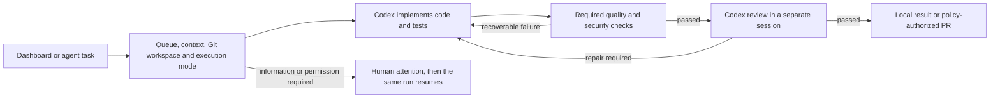

# Tweebit AI Harness by Daryna

Tweebit AI Harness by Daryna runs software tasks in local Git repositories through one command-line interface: `agent` and a private loopback dashboard. Users describe the required result; the Harness prepares the Git workspace, selects a safe execution path, runs implementation and verification, repairs recoverable failures, and returns a reviewable branch or pull request. The Python distribution remains named `ai-harness` for upgrade compatibility.

It supports single tasks, parallel work in isolated Git worktrees, batches across several repositories, background recovery, and explicit human approval when a decision cannot be made safely. Merge and deployment always remain human actions.

The v0.4.0 source is available in this repository's `main` branch. This is a source version, not a
claim of a separately published PyPI/tagged release or completed production acceptance. The Harness
uses local Git repositories, a local queue, and the Codex SDK. Its **Проекты** catalog reads only explicitly
initialized, trusted repositories and uses the same folder, Git workspace, `AGENTS.md`, and
`.agent/project.yaml` as Codex. The dashboard uses a lightweight, collapsible desktop sidebar and a
mobile off-canvas menu to separate **Проекты**, **Задачи**, **Статистика**, and **Adaptive Lab**,
with **Новая задача** remaining the single focused composer. Project and task records stay
distinct: every new task belongs to one project, while the global task list remains an operational
view across all projects. The composer keeps Auto/Adaptive/Fast/Full/Goal visible and adds private
five-file/PDF intake with defaults of 100 MiB per file and 500 MiB per task. A locally trusted
project may raise those limits to the hard ceilings of 512 MiB per file and 2.5 GiB per task.
Pending uploads are bounded to 32 sets and 6 GiB; direct runtime images are limited to 10 MiB each
and 20 references. File tasks require explicit per-task runtime consent.

Attachment upload, validation, processing, run provenance, and runtime context are implemented.
Both runtimes receive bounded text and PDF-text excerpts as explicitly untrusted data. The Codex SDK
also receives revalidated direct images and scanned PDF pages; the Codex CLI compatibility runtime
accepts text and PDF text only. Text injection is limited to 120,000 bytes total and 24,000 bytes per
reference; image context is fail-closed above 20 references rather than silently truncated. See
[`docs/tweebit-ai-harness-by-daryna-release-comparison.md`](docs/tweebit-ai-harness-by-daryna-release-comparison.md).

## How a task runs

**The Harness manages the job; Codex performs the coding work.** The Harness owns the queue, Git
workspace, task context, budgets, checkpoints, required checks, and publication permissions. Codex
reads the project, changes code, adds tests, and repairs problems within that scope. Required quality
and security tools check the result; a separate Codex reviewer examines the change before the
Harness decides whether it can finish locally or publish a PR.


```mermaid
flowchart LR
    A["Dashboard or agent task"] --> B["Queue, context, Git workspace and execution mode"]
    B --> C["Codex implements code and tests"]
    C --> D["Required quality and security checks"]
    D -->|"passed"| E["Codex review in a separate session"]
    D -->|"recoverable failure"| C
    E -->|"repair required"| C
    E -->|"passed"| F["Local result or policy-authorized PR"]
    B -->|"information or permission required"| G["Human attention, then the same run resumes"]
```

The diagram shows the core implementation and verification cycle. Full adds planning, risk
classification, test generation for code changes, and applicable specialist checks; Adaptive compiles its own
execution plan. The modes are explained below.

One run keeps its task identity, Git workspace, and checkpoint through implementation, repair, and
user answers. The working Codex session retains continuity for that work. Model-backed reviewers
and specialist verifiers start a **fresh session for each invocation**, including a recheck after a
repair. This separates review from the writer's conversation; it does not guarantee a different
model or an error-free review. Repairs stay in the same run and are bounded by its budgets. Only
independent work may become a governed child run.

Start a Harness task through the dashboard or `agent task`. A message in an ordinary Codex chat
does not automatically enter the Harness queue. By default, a task gets a dedicated branch in the
current clean checkout; parallel work requires `--worktree` or the dashboard's **Parallel task**.

### Example: fix CSV export

Assume a project already has a CSV exporter that incorrectly writes `None` for empty values. This
illustrative task requests a local result:

```sh
cd /path/to/project
agent task --mode auto --task-id fix-csv-empty \
  "Fix CSV export: empty values must remain empty cells. Add a regression test. Local only. Do not publish."
agent watch --task-id fix-csv-empty
```

1. **The Harness prepares the task.** It validates project trust and the clean checkout, creates a
   branch, loads project instructions, and selects Fast for an ordinary narrow change.
2. **Codex does the whole fix.** In Fast, the implementation role handles the exporter, the
   regression test, and ordinary repairs together, without waiting for a separate test writer.
3. **Tools verify it.** The selected project profile determines the required quality, test, and
   security commands. A failing check returns to a bounded repair cycle; it cannot be reported as
   a successful check.
4. **A fresh Codex session reviews it.** The reviewer receives scoped task and change evidence,
   separately from the working conversation. Actionable findings lead to repair and another check.
5. **The Harness returns the result.** If the required checks and review pass, this local-only task
   finishes with a reviewable branch and a report. A task requesting a PR may publish only when the
   central repository registry and policy allow it. Merge and deployment require explicit human
   authorization.

If scope or risk grows, Fast escalates before publication. Missing information or a protected
action may pause the run with a concrete question or approval request. These are possible paths,
not a promise that every example task will succeed.

### Fast and Full use different workflows

Fast gives one implementation role the complete narrow task and then uses tools plus a separate
reviewer. For code changes, Full currently uses five base model-backed roles: planner, risk classifier, implementer,
test generator, and reviewer, with specialist checks when applicable. It has not yet been reduced
to one executor. Both use the configured Codex runtime; choosing Full does not itself select a
stronger model. The profile and model settings are separate from the workflow mode. Fast normally
has two main model stages, but retries and structured-output repairs can add calls.

## Requirements

- macOS or Linux
- Git
- Python 3.11 or newer
- A ChatGPT account with Codex access and local subscription authentication

The installer creates an isolated application environment, installs the official Python Codex SDK and CLI compatibility runtime, and does not require `sudo`.

## Install

Install from a reviewed checkout of this repository:

```sh
cd /absolute/path/to/agents
./install.sh
```

For an existing Harness installation, select that checkout explicitly and verify it:

```sh
agent update --source /absolute/path/to/agents
hash -r
agent doctor --full
```

The public bootstrap installs from `mdvcode/agents` on `main`, which includes the v0.4.0 source:

```sh
curl -fsSL https://raw.githubusercontent.com/mdvcode/agents/main/install.sh | sh
```

If the shell does not immediately find `agent`, open a new terminal or refresh its command cache:

```sh
hash -r
agent --version
```

The runtime uses ChatGPT subscription authentication; a separate OpenAI API key is not required.
The Python SDK includes its own pinned Codex runtime. Updating the desktop app or a global Codex
CLI does not update the Harness's pinned SDK or configured model profiles. See the
[official Codex SDK documentation](https://learn.chatgpt.com/docs/codex-sdk).

If you maintain a source checkout as your control-plane home, select it explicitly:

```sh
agent home --set /absolute/path/to/agents
agent home --json
```

This selects the existing queue, run history, and policies; it does not move state or restart
services. Preserve the old home and stop its idle services before switching. Ordinary bundled
installations do not need this setting. See the [CLI guide](docs/cli.md) for precedence and recovery.

## Quick start

Initialize a target project and verify the complete runtime:

```sh
cd /path/to/project
agent init
agent doctor --full
```

Start a task and follow its progress:

```sh
agent task "Fix startup and add a regression test"
agent watch
```

The default remains `auto`, which selects guarded Fast or Full. To use the adaptive planner explicitly:

```sh
agent task --mode adaptive --task-id fix-startup \
  "Fix startup and add a regression test"
agent watch --task-id fix-startup
```

If an existing installation rejects `adaptive` as an unknown mode, update it from this checkout
before launching the task:

```sh
agent update --source /path/to/agents
hash -r
agent task --help
```

Adaptive is a manual Beta opt-in whose representative paired acceptance is still pending. It
analyzes the task deterministically where possible, persists an auditable
`.agent-runs/<run-id>/execution-plan.json`, and runs the minimum safe role DAG. It prefers
deterministic format, lint, type, test, secret, and dependency checks before optional model-backed
review. Low-confidence or sensitive work expands to a safer workflow; hard security, approval,
recovery, and publication gates remain mandatory.

Or use the local browser dashboard:

```sh
agent dashboard
```

The dashboard opens on **Новая задача** for focused single-task intake. **Проекты** lists
only repositories already registered by `agent init`; it does not scan the computer. Opening a
project shows its task scope and durable local context, while **Новая задача** reuses the same
composer with that project preselected. **Задачи** remains the global operational list across all
projects and contains attention, active work, history, and the progressive-disclosure batch
builder. YAML remains available only under the advanced import section. **Статистика** is a separate
full section for operational counters, service health, and worker state; task details remain in
**Задачи**.

**Открыть в Codex** uses the selected project's trusted canonical folder and the supported local
Codex workspace launcher. Tweebit does not read or mutate private Codex application databases and
does not claim to create or synchronize native Codex sidebar projects. The existing provider-neutral
runtime remains authoritative for execution; Codex SDK is one shipped provider, not the project
identity itself.

Project detail keeps **Memory**, **Skills**, and **Tools** under one compact context summary instead
of adding three more top-level sections. This release does not claim automatic long-term learning:
instructions, selected repository documentation, run artifacts, the run's Codex thread, and
consented attachments form the effective task context. Skills are role-scoped Harness playbooks;
Tools are governed capabilities and permissions, not memory. A curated editable project-memory
surface remains deferred until its provenance, freshness, retention, and runtime indexing can be
shown honestly.

**Посмотреть глазами AI** opens the Context Inspector from the task composer or a task row.
Before launch it previews the selected role's repository sources, including inclusion/exclusion
reasons, privacy/trust labels, token counts, and the assembled source package. Pending attachments
are excluded from this preview and require consent when the task starts. In an existing run, the
inspector shows verified saved inputs for individual stages: the exact prompt, response contract,
runtime settings, and source provenance. Session history, provider-internal instructions, and
subsequent file reads are outside that snapshot; older runs may not have a saved input.

The dashboard's **Adaptive Lab** section reads the backend acceptance report and
compares Full with Adaptive. `NOT ENOUGH DATA` means that the representative paired A/B acceptance
run has not been completed; it is not a failure of the current task and does not prevent explicit
`--mode adaptive` runs. **Auto** currently selects Fast or Full from task risk and does not select
Adaptive until the authoritative acceptance verdict is `PASS`; **Adaptive** is a manual Beta opt-in
before that point. They are mutually exclusive values of one execution-mode selector, not a mode
plus a checkbox. The execution mode keeps the name **Adaptive**; **Adaptive Lab** names only the
analytics and evidence section.

`agent task` refuses a stale source/install combination, starts or repairs the background worker when needed, and waits for worker readiness before reporting a healthy launch. If the task was already queued when worker startup failed, the error preserves its run id and prints the exact restart/watch commands instead of discarding the work. The project checkout must be clean before a task can create or switch branches.

`agent init` creates `.agent/project.yaml` and, when absent, `AGENTS.md`. If Git already ignores either file, keep it local and do not force-add it. Otherwise, commit the new file or add a repository-approved ignore rule before starting work.

## Everyday usage

### One task in one repository

```sh
cd /projects/backend
agent task "Fix report export and add a regression test"
agent watch
```

By default, the Harness creates a dedicated task branch in the current checkout. Only one unfinished task may own that checkout.

### One parallel task in an isolated worktree

```sh
agent task --worktree --task-id report-filters \
  "Add report filters without blocking the export task"
```

The worktree has its own branch and checkout but reuses shared pip, uv, npm, Bun, and repository build caches. CLI users opt in explicitly with `--worktree`; the dashboard's **Parallel task** option selects it automatically.

### Several tasks in one batch

Create `tasks.yaml`:

```yaml
version: 1
repositories:
  backend:
    path: /projects/backend
    max_parallel_tasks: 3
  frontend:
    path: /projects/frontend
    max_parallel_tasks: 2
tasks:
  - repo: backend
    goal: Fix report export
  - repo: backend
    goal: Add report filters
    parallel: true
  - repo: frontend
    goal: Fix the navigation menu
    parallel: true
```

Validate it without changing queue or Git state:

```sh
agent batch --file tasks.yaml --dry-run --json
```

Then enqueue the batch:

```sh
agent batch --file tasks.yaml
agent dashboard
```

`parallel: true` gives that task an isolated worktree. `max_parallel_tasks` is enforced when workers claim tasks, so a busy repository or shared test database cannot consume more than its configured capacity. The dashboard's **Задачи** section can filter authoritative task data by attention, lifecycle, repository, branch, or worker.

The loopback API accepts the same data at `POST /tasks/batch`, either as a YAML `manifest` string or as `repositories` and `tasks` JSON fields. The dashboard is the simplest visual API client and preserves the existing loopback authentication boundary.

### Background child tasks

Users do not create child runs manually. During implementation, Codex may propose a genuinely independent subtask, but deterministic Harness code decides whether it is safe to start.

A writing child receives:

- its own worktree, branch, and Codex thread;
- a strict token and duration budget;
- an explicit `allowed_paths` scope;
- a blocking or non-blocking dependency on its parent;
- no permission to commit, push, publish, merge, or expand scope.

The parent consumes each child result once, handles join conflicts, resumes its original Codex thread, and reruns the complete verification path over the combined diff. Fan-out is limited to three children and graph depth to two levels. Cross-repository work should be submitted explicitly as a batch instead of being invented by a child task.

### Monitor and intervene

```sh
agent status
agent watch --run-id <run-id>
agent failures --run-id <run-id>
```

The status stream reports the current phase, latest SDK event, active tool, time since progress, token budget, and stop reason. The dashboard groups work as **Queued**, **Running**, **Testing**, **Needs input**, **PR ready**, and **Failed**. When active branches touch the same paths, it marks a probable conflict and recommends which branch should publish first and which should rebase and verify again.

## Task execution modes

The default mode is `auto`:

```sh
agent task "Fix a typo in the settings page"
agent task --mode adaptive "Fix a small backend bug and add a regression test"
agent task --mode fast "Apply a small local styling change"
agent task --mode full "Refactor the authentication architecture"
agent task --mode goal "Complete a checkpointed multi-hour objective"
```

| Mode | Behavior |
| --- | --- |
| `auto` | Selects the guarded Fast or Full workflow from task risk. It cannot select Adaptive until the authoritative acceptance verdict is `PASS`, and it never selects `goal`. |
| `adaptive` | Manual Beta opt-in to deterministic task analysis and an auditable minimum-safe execution DAG. Optional roles may be skipped, independent read-only checks may run in parallel, and model-backed roles receive scoped context and the cheapest sufficient profile. Low confidence expands the plan safely. |
| `fast` | Runs the short workflow for at most 15 minutes, with implementation and review as the only model-backed roles. Context, quality, security, and verdict stages are deterministic. |
| `full` | Runs planning, risk classification, implementation, test generation for code changes, review, and applicable specialist checks for at most 60 minutes. |
| `goal` | Explicitly runs a checkpointed long objective for at most 4 hours. Use it only when the success condition genuinely needs multiple hours. |

Choose exactly one execution mode per task; Adaptive is not an additional checkbox. Use `auto` for the current default behavior and `adaptive` when explicitly evaluating or using the Beta planner. Fast mode automatically escalates to the full workflow before publication if the patch touches protected areas, changes more than five files, exceeds 200 changed lines, or reports increased risk. Required checks and approval gates are never bypassed. The 30-minute role timeout is an emergency limit for one model executor, not the duration of the whole task; workflow, recovery, iteration, and human-attention limits are tracked separately.

## Branch and workspace modes

By default, a task creates or selects a dedicated task branch in the current checkout:

```sh
agent task --task-id fix-startup "Fix startup"
```

Use the clean, already checked-out non-default branch:

```sh
agent task --current-branch "Continue work on this branch"
```

Use an isolated Git worktree for intentional parallel work:

```sh
agent task --worktree --task-id parallel-fix "Run this task in parallel"
```

Configure generated branch names or a different base branch during initialization:

```sh
agent init --force --base-branch develop
agent init --force --branch-prefix team/backend/
```

## Human attention and recovery

When execution needs information, `agent status` or `agent watch` prints an `ATTENTION REQUIRED` block and the exact next command. Answer the same run without starting a replacement task:

```sh
agent answer <run-id> "Use the existing API and preserve backward compatibility"
agent watch --run-id <run-id>
```

Do not include passwords, tokens, private customer data, or other secrets in an answer.

Risk, security, protected-path, and publication decisions require an explicit scoped approval:

```sh
agent approve --run-id <run-id> --reason "Reviewed the reported scope and risk"
```

Use `answer` for missing information and `approve` only for the exact authority request shown by the system.

## Command reference

Run `agent <command> --help` for the complete generated option list.

### Version and updates

```sh
agent --version
agent update
agent update --source /path/to/new/ai-harness
agent update --json
```

- `agent --version` prints the installed version.
- `agent update` updates the installed package source, verifies the CLI, and restarts the worker
  service. A dirty source checkout is never overwritten.
- `--source` installs an explicitly selected local folder, `git+https`, or `git+ssh` source.
- Use `agent update --source /absolute/path/to/agents` when intentionally installing a specific
  reviewed checkout rather than updating the existing source.

### Project initialization

```sh
agent init [--repo PATH] [--project-id ID]
           [--profile auto|agent_workspace|django|nextjs_web]
           [--base-branch BRANCH] [--branch-prefix PREFIX]
           [--force] [--replace-agents] [--json]
```

- `--profile` selects or auto-detects the project validation profile.
- `--force` replaces `.agent/project.yaml` while preserving an existing `AGENTS.md`.
- `--replace-agents` allows `--force` to replace `AGENTS.md` as well.

### Create a task

```sh
agent task [--repo PATH] [--task-id ID] [--branch BRANCH]
           [--current-branch | --worktree] [--keep-paused]
           [--mode auto|adaptive|fast|full|goal] [--priority -100..100]
           [--max-retries 0..10] [--dry-run] [--json]
           "TASK DESCRIPTION"
```

- `--dry-run --json` validates and displays the task envelope without switching branches, starting workers, or changing queue state.
- `--keep-paused` prevents a new task from replacing an older paused task that owns the same checkout.
- Reusing the same explicit `--task-id` returns the existing queue item instead of creating a duplicate.

### Create a task batch

```sh
agent batch --file tasks.yaml [--dry-run] [--json]
cat tasks.yaml | agent batch --file -
```

- A batch may contain up to 50 validated tasks.
- Repository definitions may set `max_parallel_tasks` from 1 to 32.
- `parallel: true` selects an isolated worktree for that item.
- Each item still passes through ordinary project trust, branch, policy, and queue intake checks.
- Invalid items are returned with per-item diagnostics; accepted items retain one shared batch id.

### Worker service

```sh
agent start [--repo PATH] [--workers 1..32] [--json]
agent stop [--json]

agent worker status [--json]
agent worker start [--workers 1..32] [--json]
agent worker restart [--workers 1..32] [--json]
agent worker stop [--json]
```

- `agent start` validates the current project and proactively starts workers. It is optional because `agent task` starts them when necessary.
- `agent stop` and `agent worker stop` gracefully stop the persistent service.
- `agent worker ...` controls the service directly without performing project startup validation.

### Dashboard

```sh
agent dashboard [--repo PATH] [--port PORT] [--no-open]
```

The dashboard binds to loopback and opens in the default browser. A lightweight collapsible sidebar
on desktop, and an accessible off-canvas menu on mobile, navigate between **Проекты**, **Задачи**,
**Статистика**, and **Adaptive Lab**. **Новая задача** provides focused single-task launch, the trusted initialized-project
selector, attachment context, execution-mode (`auto`, `adaptive`, `fast`, `full`, or explicit
`goal`), and Git-workspace selection. The project catalog uses only explicitly registered trusted
repositories and does not grant additional execution or publication authority. **Задачи** contains attention-first task filtering, active work, history, probable-conflict
hints, structured answer choices with a custom-answer fallback, approval, retry, abort controls, and
the progressive-disclosure visual/YAML batch tools. **Статистика** is a separate full section for
operational counters, service health, and worker state; it does not duplicate task details.
**Adaptive Lab** is reserved for efficiency analysis: it compares evaluator-produced Full/Adaptive
metrics and exposes filterable paired-run evidence, persisted execution plans,
executed/skipped/deterministic roles, model profiles, cache and token use, repair loops, and
escalation counters. The execution mode itself remains named **Adaptive**. The browser never
calculates or overrides the authoritative acceptance, security, or approval verdict. `NOT ENOUGH
DATA` is the expected status until authoritative paired acceptance evidence exists. Answered
questions are fingerprinted so the same question cannot silently reopen in a loop. `--no-open`
starts the dashboard server without opening a browser. `Ctrl+C` stops the dashboard server but does
not stop the worker service.

### Status and monitoring

```sh
agent status [--repo PATH] [--limit 1..100] [--json]

agent watch [--repo PATH] [--task-id ID] [--run-id ID]
            [--interval SECONDS] [--timeout SECONDS] [--json]
```

- `status` shows compact project, queue, run, and worker state without raw model transcripts.
- `watch` follows state transitions until completion or human attention and returns after 30 minutes by default. Use `--timeout 0` only when an intentionally unbounded terminal wait is desired; if the worker service is down, `watch` returns immediately with the start command.

### Failure inspection

```sh
agent failures [--repo PATH] [--run-id ID] [--limit 1..500] [--json]
agent dead-letters [--repo PATH] [--limit 1..500] [--json]
```

- `failures` lists structured failures and their recovery decisions.
- `dead-letters` lists tasks whose bounded automatic recovery budget is exhausted.

### Run recovery and cancellation

```sh
agent retry <run-id> [--repo PATH] [--json]
agent resume <run-id> [--repo PATH] [--json]
agent abort <run-id> [--repo PATH] [--json]
```

- `retry` retries an existing failed or paused run after its underlying problem has been corrected.
- `resume` continues an existing recorded checkpoint.
- `abort` cancels the run, terminates its active process group when necessary, and preserves its branch, worktree, and run records.

### Human response and approval

```sh
agent answer <run-id> "RESPONSE" [--repo PATH] [--actor NAME] [--json]

agent approve [--repo PATH] [--run-id ID]
              [--actor NAME] [--reason TEXT] [--json]
```

- `answer` supplies missing information and resumes the same checkpoint.
- `approve` consumes one pending scoped approval. When only one eligible run exists, `--run-id` may be omitted.

### Diagnostics

```sh
agent doctor [--repo PATH] [--json]
agent doctor --full [--repo PATH] [--json]
```

The ordinary diagnostic checks installation resources, recovery policy, project configuration, local trust, Git state, Python dependencies, Codex CLI availability, and worker health. `--full` additionally performs the authenticated runtime preflight and may take longer.

## Common operating sequence

```sh
agent doctor --full
agent status
agent failures
agent dead-letters
agent worker status
```

If the worker is unhealthy after an update:

```sh
agent worker restart
agent doctor --full
```

Do not edit queue database rows or workflow state files manually. The recovery commands preserve authoritative run identity, checkpoints, leases, and task workspaces.

## Safety model

- The checkout must be clean before branch switching.
- Protected paths, secrets, authentication, billing, payments, migrations, and production infrastructure receive elevated handling.
- Failed or unavailable required checks cannot be published as successful.
- Low- and medium-risk work may be prepared for review only when repository policy allows it.
- The system never auto-merges or deploys.
- Private run state, raw events, and local memory remain in the Harness control plane and must not be copied into public project output.

## What to build next

This roadmap was checked against official documentation on **2026-10-07**. Result acceptance,
descriptive Fast/Full comparison and explicit per-task model choice are now implemented; the
next step is collecting representative results, rather than treating feature availability as quality evidence.

The relevant recent changes are GPT-6.1 Sol availability on September 29, opt-in input steering in
CLI 0.159, and resume/reconnection/subagent fixes in CLI 0.160. CLI 0.160.1 adds a remote Windows
MCP environment fix. See the [official changelog](https://learn.chatgpt.com/docs/changelog).
These client features are not automatically available through the Harness's pinned SDK. The
[Python SDK documentation](https://learn.chatgpt.com/docs/codex-sdk) explains its pinned runtime;
the current repository pins `openai-codex==0.144.4` and GPT-5.6 profiles.

| Priority | Next delivery slice | Evidence needed before adopting it |
| --- | --- | --- |
| 1 | Collect human result assessments on representative tasks using the new result viewer and comparison table. | Compare like inputs, versions, project, scope and budgets. A completed workflow is not proof that its result was accepted. Missing measurements remain unknown; existing Adaptive/Step 2/production acceptance gates stay separate. See [result acceptance](docs/result-acceptance.md). |
| 2 | Evaluate a pinned SDK upgrade against the current baseline; use the new model picker for explicit experiments. | The picker uses the runtime catalog rather than a hardcoded release list. Run authenticated preflight, installed-package smoke, real task and repair/resume/reviewer-isolation checks before adopting a newer pin or defaults. The current pinned runtime still returns GPT-5.6 models. |
| 3 | Evaluate a simpler Full workflow: one coherent executor, mandatory tool checks, a fresh reviewer, and specialist checks selected by risk. | Demonstrate equal or better acceptance on the paired corpus without removing protected-path, security or publication gates. Preserve Fast/Full as scope, budget and verification-depth choices. This redesign is not implemented yet. |
| 4 | Add in-progress steering through the supported SDK/app-server interface. | Persist each instruction against the same run, distinguish accepted/queued/uncertain delivery, and test reconnects without duplicate instructions or lost checkpoints. A native CLI feature alone does not establish adapter support. |

The recommended product direction is a reliable orchestration and acceptance layer around Codex:
project policies, isolation, recovery, independent verification, and evidence that the result helps
the user. Curated project memory can follow with source attribution, review dates, and explicit
update/deletion rules; the current dashboard context summary does not provide that lifecycle.

Consider the [Agents API](https://developers.openai.com/api/docs/guides/agents-api/overview) when a
deployment needs managed cloud sessions and execution. It uses API billing, including applicable
tool and sandbox charges; it is a separate integration from the local subscription-backed SDK.
It is not required for the current local Harness workflow.

## Documentation

- [CLI guide](docs/cli.md)
- [Result acceptance and comparison](docs/result-acceptance.md)
- [Operator runbook](docs/operator-runbook.md)
- [Onboarding](docs/onboarding.md)
- [System architecture](docs/agent-system.md)
- [Policy](.agent-policy.yaml)
- [Project profiles](.agent-project-profiles.yaml)

## Development checks

From this repository:

```sh
make validate-artifacts
make security
make check
```

`make check` validates contracts, runs the security scan and complete test suite, and checks the Git diff for whitespace errors.
