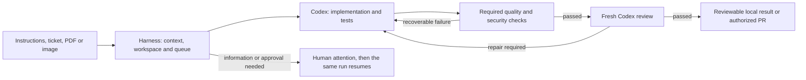

# Tweebit AI Harness by Daryna

**Describe the result. Codex writes the code. Tweebit manages the work and verifies the result.**

Tweebit runs software tasks in local Git repositories through the `agent` command and a private
browser dashboard. It prepares a branch or worktree, supplies project context, manages checkpoints
and repairs, runs required checks, and returns a reviewable result. You can start from written
instructions, a GitHub or Jira ticket, a PDF, an image, or a combination of these inputs.

The v0.4.0 source is available on `main`. The Python package is named `ai-harness` for upgrade
compatibility. Source availability does not establish a separate PyPI/tagged release or completed
production acceptance.

[Quick start](#quick-start) · [How it works](#how-it-works) · [Tickets and files](#tickets-and-files) ·
[Modes and models](#modes-and-models) · [Results](#review-and-accept-the-result) ·
[Updates](#updates-and-maintenance) · [Documentation](#documentation)

## Quick start

### 1. Install

Requirements: **macOS or Linux**, **Git**, **Python 3.11+**, and a locally authenticated ChatGPT
account with Codex access. The installer creates an isolated application environment, installs the
official Python Codex SDK and CLI compatibility runtime, and does not require `sudo`.

From a reviewed checkout:

```sh
cd /absolute/path/to/agents
./install.sh
```

Alternatively, the public bootstrap installs from this repository's `main`:

```sh
curl -fsSL https://raw.githubusercontent.com/mdvcode/agents/main/install.sh | sh
```

If your shell cannot find `agent`, open a new terminal or run `hash -r`. The local runtime uses your
ChatGPT subscription; a separate OpenAI API key is not required.

### 2. Initialize your project

```sh
cd /path/to/project
agent init
agent doctor --full
```

`agent init` creates `.agent/project.yaml` and, when absent, `AGENTS.md`. Before launching a task,
keep the checkout clean: commit these files or use a repository-approved ignore rule. Already
ignored setup files can remain local; do not force-add them. Project initialization sets local
execution identity and trust, without granting publication or deployment permissions.

### 3. Launch from the dashboard or terminal

```sh
agent dashboard
```

In **Новая задача**, select your project, describe the required result or add a ticket/files,
choose a mode and optional model, and launch. When adding files, confirm that their contents may
be sent to the runtime.

For the same flow from the terminal:

```sh
agent task --task-id fix-csv-empty \
  "Fix CSV export: empty values must remain empty cells. Add a regression test. Local only. Do not publish."
agent watch --task-id fix-csv-empty
```

A normal Codex chat message does not automatically enter the Harness queue. Use **Новая задача**
or `agent task`. The CLI starts or repairs the background worker when needed. An unfinished task
owns its checkout; use a worktree when starting independent work in parallel.

## How it works

**The Harness manages the job; Codex performs the coding work.**

| Responsibility | Owner |
| --- | --- |
| Queue, Git workspace, project context, budgets, checkpoints and permissions | Harness |
| Reading the project, implementation, tests and bounded repairs | Codex working session |
| Required quality, test and security commands | Tools selected by the project profile |
| Independent examination of the change | Fresh Codex reviewer session |
| Result acceptance, scoped approvals, merge and deployment decisions | You |


```mermaid
flowchart LR
    A["Instructions, ticket, PDF or image"] --> B["Harness: context, workspace and queue"]
    B --> C["Codex: implementation and tests"]
    C --> D["Required quality and security checks"]
    D -->|"passed"| E["Fresh Codex review"]
    D -->|"recoverable failure"| C
    E -->|"repair required"| C
    E -->|"passed"| F["Reviewable local result or authorized PR"]
    B -->|"information or approval needed"| G["Human attention, then the same run resumes"]
```

The diagram shows the core cycle. Full adds planning, risk classification, test generation for
code changes and applicable specialist checks. Adaptive compiles a scoped execution plan.

A run keeps its identity, workspace and checkpoint through repairs and user answers. The working
Codex session retains continuity; reviewers and specialist verifiers use a fresh session for each
invocation, including after repair. A fresh review does not guarantee a different model or an
error-free result. Repairs remain bounded by the run's budgets and permission gates.

For the CSV example above, the Harness prepares the branch and selects Fast for a narrow change.
Codex fixes the exporter and adds the regression test, tools check it, and a fresh reviewer examines
the diff. A recoverable failure returns to repair. Passing checks and review produce a local
branch and report; publishing a PR also requires your request and central repository policy.

## Tickets and files

Choose the initialized **local project** first. A Jira issue identifies the assignment, not the
Git repository where it should be implemented.

### GitHub and Jira Cloud

| Source | Accepted references | Setup |
| --- | --- | --- |
| GitHub | `42`, `#42`, `owner/repo#42`, or `https://github.com/owner/repo/issues/42` | Existing authenticated `gh`; the reference must match the selected project's verified GitHub `origin`. |
| Jira Cloud | `TEAM-123` or `https://example.atlassian.net/browse/TEAM-123` | Optional official `acli`, authenticated to the intended Jira site. A URL must match its active site. |

These are alternative examples, run from the appropriate initialized project:

```sh
agent task --ticket '#42' --task-id issue-42
agent task --ticket 'TEAM-123' --task-id team-123 "Preserve the existing layout."
```

Quote a reference beginning with `#` so the shell does not treat it as a comment. For first-time
Jira setup, follow the [official ACLI installation guide](https://developer.atlassian.com/cloud/acli/guides/install-macos/),
then use `acli jira auth login` and check `acli jira auth status`. A Jira connection in the Codex
app has its own session; Harness uses the CLI session. Harness does not create or store tracker
credentials. ACLI manages its own session and vendor telemetry/error reporting; logical tool
policy is not an operating-system network sandbox.

Ticket-only tasks default to local work. The Harness saves the ticket's identity, title, body and
content hash as private, untrusted source data. Ticket content cannot authorize publication,
merge, deployment or permission changes. Your extra instructions are separate from that content.
Use a new task ID if the source changes; an existing run is not silently replaced.

Self-hosted Jira, custom tracker domains, GitHub Enterprise hosts, pull request URLs, automatic
issue monitoring and automatic downloads of linked files are not supported. Provide needed files
explicitly. See the [ticket and file guide](docs/cli.md#start-from-a-ticket-or-files) for validation,
source snapshots and retry behavior.

### PDF and images

Combine a ticket with local requirements and a screenshot, or supply the whole assignment as files:

```sh
agent task --ticket '#42' --task-id issue-42-files \
  --attach /path/to/requirements.pdf --attach /path/to/screen.png \
  --attachment-runtime-consent "Keep the existing keyboard shortcuts."
agent task --attach /path/to/requirements.pdf --attachment-runtime-consent
agent task --attach /path/to/screen.png --attachment-runtime-consent
```

In the dashboard, use **Задача GitHub или Jira** and **Добавить файлы**. Errors preserve the draft
and selected files. **Свой идентификатор запуска** is an internal task ID, separate from the ticket
reference.

- File contents require explicit consent for each submission. File-only tasks default to local
  work and do not publish.
- Up to **5 files**, normally **100 MiB per file** and **500 MiB per task**. Trusted project overrides
  and separate runtime limits apply; large files are processed into bounded excerpts.
- The SDK receives bounded text/PDF-text, supported images and scanned PDF pages. The CLI
  compatibility runtime accepts text and PDF text only.
- Use a new task ID for a new attachment submission. Attachment intake does not support `--dry-run`.

## Modes and models

### Choose the workflow depth

Both Fast and Full delegate coding to Codex. They differ in preparation, verification depth and
budget; **Full does not automatically select a stronger model**.

| Mode | When to use it | Current behavior |
| --- | --- | --- |
| **Auto** — default | Ordinary work with automatic risk routing | Selects guarded Fast or Full. Never selects Goal; Adaptive is gated by separate acceptance evidence. |
| **Fast** | A narrow, well-defined change | One implementation role handles code, tests and ordinary repairs, followed by required tools and a fresh reviewer. Workflow budget: **15 minutes**. |
| **Full** | Broader or more sensitive work | Planning, risk classification, implementation, test generation for code changes, review and applicable specialist checks. Workflow budget: **60 minutes**. |
| **Adaptive** — Beta, explicit opt-in | Evaluating a scoped execution plan | Deterministic analysis selects the minimum safe role DAG; low confidence expands the plan. Representative paired acceptance remains pending. |
| **Goal** — explicit opt-in | A checkpointed objective needing several hours | Long-workflow budget: **4 hours**. |

```sh
agent task --mode fast "Fix CSV quoting and add a regression test. Local only. Do not publish."
agent task --mode full "Refactor report export while preserving compatibility. Local only. Do not publish."
```

Select one mode per task. Fast escalates to Full before publication if the patch touches protected
areas, changes more than five files, exceeds 200 changed lines or reports increased risk. Required
checks and approval gates stay mandatory. The separate **30-minute role timeout** is an emergency
bound for one executor, not the duration of the whole workflow.

Full currently retains its separate planner, risk classifier and test generator; reducing it to
one coherent executor is a future experiment. See [system architecture](docs/agent-system.md).

### Choose the model separately

Leave **Модель → По настройкам системы** to use each role's configured profile, or select a model
from the account's actual runtime catalog. The SDK is pinned to **`openai-codex==0.161.0`**; existing
role defaults remain unchanged. New model availability does not silently change those defaults.

When GPT-6.1 Sol is available in your catalog, the terminal equivalent is:

```sh
agent task --model gpt-6.1-sol "Fix CSV export and add a regression test. Local only. Do not publish."
```

The choice applies to the task's model-backed roles and survives checkpoint resume. Availability
is validated at intake and execution. Model choice cannot change providers, authentication,
permissions, execution mode or publication authority. Updating the desktop app or a global Codex
CLI does not update the Harness's pinned SDK.

## Review and accept the result

Open **Задачи → Посмотреть результат** to inspect the summary, changed files, check/review status
and PR link when present. Then record your assessment:

| Assessment | Meaning |
| --- | --- |
| **Принято** | The reviewed result meets your goal. |
| **Нужны правки** | Explain the required corrections; **Подготовить задачу для правок** creates a draft to review and launch. |
| **Отклонено** | Record why the result should not be accepted. |

Acceptance records feedback against the reviewed result. It does not grant approval or
publication/merge authority, and does not automatically launch repairs or resume the old run.

**Статистика** shows assessments, duration, tokens, repairs and recorded user interventions for
Fast, Full and the separate **Codex SDK · один проход** baseline. Missing measurements stay unknown.
The ordinary desktop Codex chat is not measured here. **Adaptive Lab** compares Full and Adaptive;
`NOT ENOUGH DATA` means paired acceptance evidence is still missing, not that your task failed.
See [result acceptance and comparison](docs/result-acceptance.md) for measurement limits.

## Parallel work and human attention

By default, one unfinished task owns the current checkout. For independent work, use the
dashboard's **Параллельная задача** option or an isolated worktree:

```sh
agent task --worktree --task-id report-filters \
  "Add report filters and regression tests. Local only. Do not publish."
agent status
agent watch --task-id report-filters
```

For multiple repositories or a task batch, see the [batch guide](docs/cli.md#submit-a-task-batch).
Governed child work is started only when deterministic Harness rules allow it; children cannot
publish independently. The parent verifies the combined change again.

When a run needs input, the dashboard or `agent watch` shows the concrete next action:

```sh
agent answer <run-id> "Use the existing API and preserve backward compatibility"
agent approve --run-id <run-id> --reason "Reviewed the reported scope and risk"
agent watch --run-id <run-id>
```

Use `answer` for information and `approve` only for the exact scoped permission request. Do not put
credentials or secrets in an answer. Both preserve the existing run and checkpoint.

## Updates and maintenance

For an existing installation:

```sh
agent update
agent doctor --full
```

`agent update` refreshes the installed package source, verifies the CLI and restarts the worker.
It refuses to overwrite a dirty source checkout. To install an explicitly reviewed local checkout
at its current revision, use:

```sh
agent update --source /absolute/path/to/agents
agent doctor --full
```

An explicit `--source` does not pull that checkout. Bring it to the reviewed revision first.
Dependency updates are proposed by **Dependabot every Monday at 07:00 Europe/Berlin**, for pip and
GitHub Actions. PR checks install the declared SDK and test its event contract. Review and merge
updates before running the updater; dependency PRs do not automatically merge or install locally.

Use these commands to inspect problems and recover through the supported lifecycle:

```sh
agent worker status
agent failures --run-id <run-id>
agent dead-letters
agent retry <run-id>
agent resume <run-id>
```

Follow the reported cause and fix it before retrying. If the worker is unhealthy after an update,
use `agent worker restart` and then `agent doctor --full`. Do not edit queue rows or workflow state
manually.

For contributors using a source checkout as the private control-plane home, `agent home --set
/absolute/path/to/agents` selects its existing queue, run history and policies. It does not move
state or restart services. Stop idle services and preserve the old home before switching. Ordinary
bundled installations do not need this setting; see the [CLI guide](docs/cli.md).

## Safety and scope

- The dashboard binds to loopback. **Проекты** contains only explicitly initialized, trusted
  repositories; it does not scan the computer.
- **Открыть в Codex** opens the trusted project folder; native Codex sidebar projects are not
  synchronized through private application databases.
- **Посмотреть глазами AI** previews local role context before launch. Ticket content and pending
  files are excluded; saved stage inputs become available during execution. It is not a snapshot
  of all provider instructions, session history or subsequent file reads.
- Project context uses instructions, selected documentation, scoped skills and consented inputs.
  Automatic long-term learning and an editable project-memory lifecycle are not claimed.
- Protected paths, secrets, authentication, billing, migrations and production infrastructure
  receive elevated handling. Failed required checks cannot be published as successful.
- Local execution is distinct from publication. A PR needs your request and central repository
  policy; merge and deployment require explicit human authorization and are never automatic.
- Private inputs, raw events, run records and memory remain in the Harness home and must not be
  copied into public project output.

## What to build next

Current delivery includes result acceptance, model choice, GitHub/Jira intake, PDF/images,
SDK0.161.0 compatibility and checked dependency-update PRs. The next steps need evidence:

1. **Collect representative accepted results.** Compare like tasks across the direct SDK baseline,
   Fast and Full by quality, elapsed time and user interventions; completion alone is not acceptance.
2. **Evaluate a simpler Full workflow.** Try one coherent executor with mandatory tools, a fresh
   reviewer and risk-selected specialists. Adopt it only if paired results preserve quality and
   existing security/publication gates.
3. **Add durable in-progress steering.** Persist new user instructions against the same run and
   verify reconnects, delivery status and deduplication through the supported SDK interface.
4. **Build curated project memory.** Require source attribution, review dates, retention and clear
   update/deletion rules before expanding the current context summary.

Managed cloud execution would be a separate API integration. It is not required for the current
local subscription-backed workflow. Adaptive, concurrency and production acceptance remain
separate gates; an implemented feature is not proof that those gates have passed.

## Documentation

| Guide | Use it for |
| --- | --- |
| [CLI guide](docs/cli.md) | Full commands/options, ticket setup, files, batches and recovery |
| [Result acceptance and comparison](docs/result-acceptance.md) | Feedback, metrics and verified SDK baseline |
| [Operator runbook](docs/operator-runbook.md) | Worker operations and incident handling |
| [System architecture](docs/agent-system.md) | Roles, routing, context and runtime boundaries |
| [Onboarding](docs/onboarding.md) | Contributor workflow and acceptance gates |
| [Release comparison](docs/tweebit-ai-harness-by-daryna-release-comparison.md) | Detailed attachment/runtime boundaries |
| [Official Codex SDK documentation](https://learn.chatgpt.com/docs/codex-sdk) | Subscription runtime integration and SDK interfaces |
| [Policy](.agent-policy.yaml) / [Project profiles](.agent-project-profiles.yaml) | Permissions and required checks |

Run `agent <command> --help` for the generated option list. From this repository, contributors run:

```sh
make validate-artifacts
make security
make check
```

`make check` validates contracts, runs the security scan and full test suite, and checks the diff
for whitespace errors.
